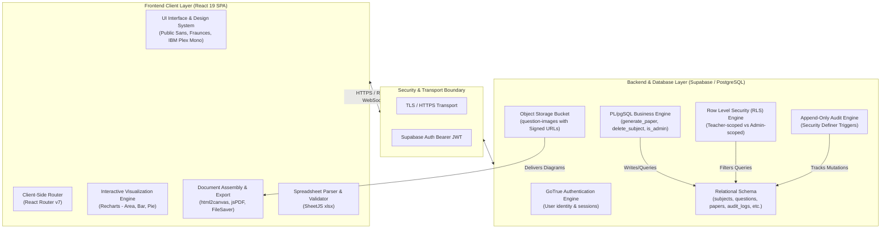
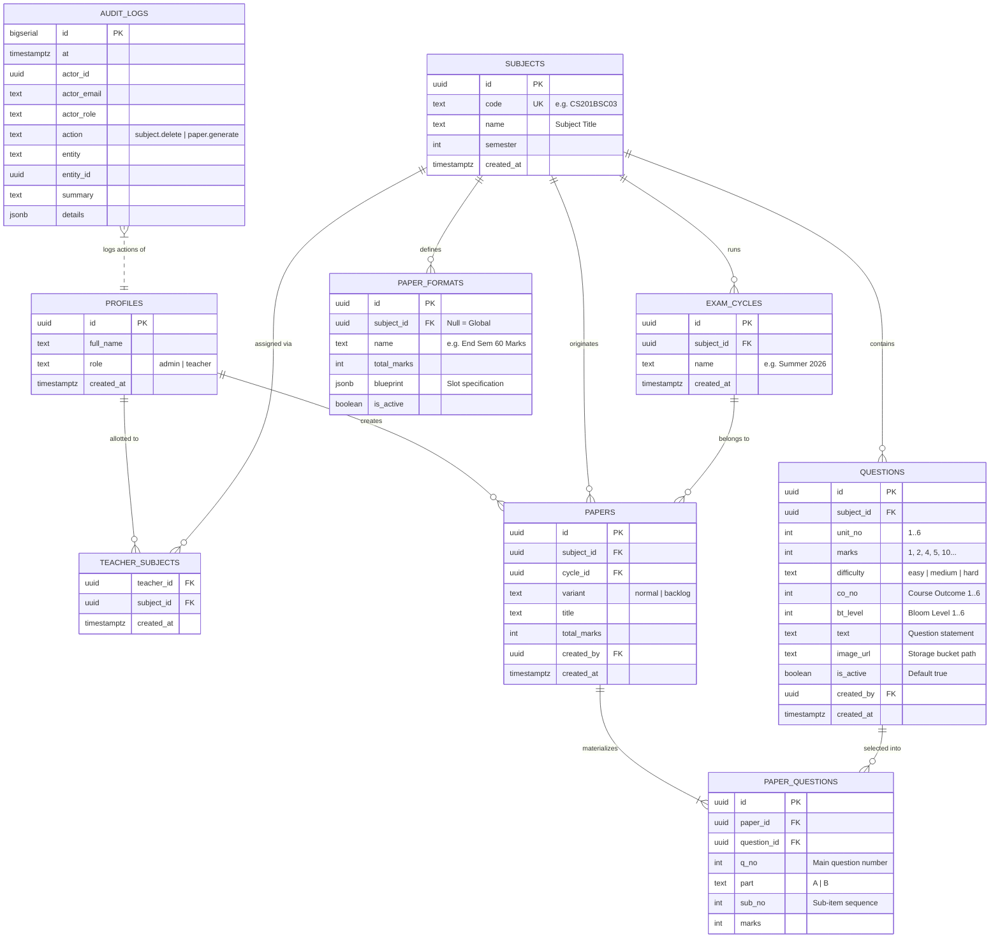
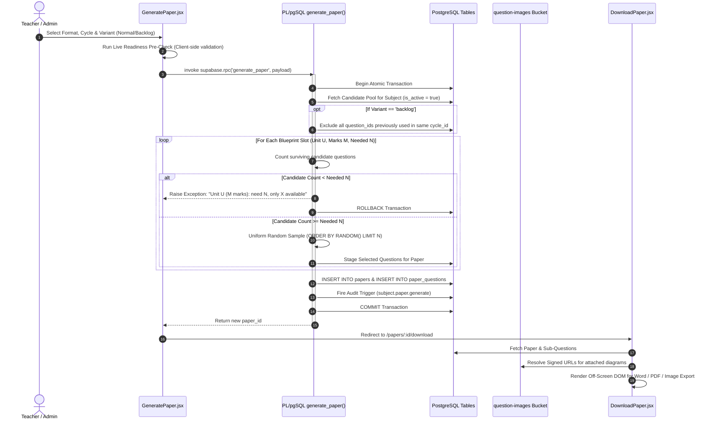
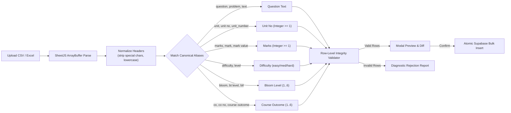

# TeacherEase — Smart Question Paper Generator
## Comprehensive System Architecture, Implementation & Working Documentation

---

### Executive Summary

**TeacherEase** (Smart Question Paper Generator) is an institutional-grade, automated examination authoring and management platform developed for the Department of Computer Science & Engineering at **P. R. Pote Patil College of Engineering and Management (Autonomous), Amravati**.

The platform streamlines the end-to-end examination lifecycle: from managing unit-wise question banks aligned with **Outcome-Based Education (OBE)**, **Bloom’s Taxonomy (BTL 1–6)**, and **Course Outcomes (CO1–CO6)**, to programmatically synthesizing blueprint-conforming question papers with mathematical guarantees of **zero question repetition** across regular and backlog exam cycles. Generated papers are exported in identical, publication-ready layouts across Microsoft Word (`.doc`), Adobe PDF (`.pdf`), and high-resolution raster image (`.png`) formats without client-side question leakage.

---

## 1. High-Level System Architecture

The application adopts a **Modern Cloud-Native Three-Tier Architecture** centered around React 19, Supabase (PostgreSQL with PL/pgSQL, PostgREST, and GoTrue Auth), and client-side document rendering engines.



### Layered Separation of Concerns
1. **Presentation & Interaction Layer:** Pure client-side React 19 single-page application (SPA). Implements responsive UI stationery theme inspired by physical academic answer sheets and ledgers.
2. **Security & Authorization Layer:** PostgreSQL Row Level Security (RLS) policies evaluated at the database level. Every REST endpoint generated by PostgREST strictly enforces data visibility according to the authenticated user's role (`admin` vs `teacher`).
3. **Business Logic & Generation Engine:** Transactional PL/pgSQL functions (`generate_paper`, `delete_subject`) running directly inside PostgreSQL. Guarantees ACID transactional compliance, strict slot sufficiency checking, and cycle exclusion.
4. **Storage & Content Delivery Layer:** Supabase Object Storage hosting diagrammatic question assets with short-lived signed URLs, protecting media from unauthorized public access.

---

## 2. Complete Technology Stack

| Layer | Technology | Version | Purpose & Rationale |
| :--- | :--- | :--- | :--- |
| **Frontend Framework** | **React** | `19.2.7` | High-performance declarative component architecture with modern hooks. |
| **DOM Renderer** | **React DOM** | `19.2.7` | Web platform rendering bridge for React. |
| **Routing** | **React Router DOM** | `7.18.1` | Declarative client-side routing, route guards (`RequireRole`), and dynamic parameters. |
| **Data Visualizations** | **Recharts** | `^2.15` | Composable SVG chart library for data-driven analytics and NBA/OBE distribution metrics. |
| **Database & Auth** | **Supabase JS** | `^2.110.7` | PostgreSQL client, real-time subscription interface, and JWT authentication manager. |
| **Database Engine** | **PostgreSQL** | `15+` | ACID-compliant relational engine with JSONB, PL/pgSQL, and Row Level Security. |
| **Spreadsheet Processing**| **SheetJS (xlsx)** | `^0.18.5` | In-memory spreadsheet parsing, normalization, template generation, and workbook export. |
| **Canvas Rasterization** | **html2canvas** | `^1.4.1` | Off-screen DOM rendering to high-fidelity `<canvas>` at device pixel ratio. |
| **PDF Generation** | **jsPDF** | `^4.2.1` | Direct client-side PDF document compilation and paging. |
| **File I/O** | **FileSaver.js** | `^2.0.5` | Cross-browser binary blob and document download dispatcher. |
| **Build & Tooling** | **React Scripts** | `5.0.1` | Webpack 5 bundle pipeline, Babel compiler, and asset optimizer. |
| **Typography** | **Google Fonts** | — | `Fraunces` (Headings/Display), `Public Sans` (Body text), `IBM Plex Mono` (Clerical records). |

---

## 3. Database Schema & Data Models

The database resides in Supabase PostgreSQL and is governed by foreign key constraints, indexes, RLS policies, and append-only audit triggers.



### Table Specifications & Security Policies

1. **`profiles`**:
   * Bridges Supabase Auth (`auth.users`) to institutional roles.
   * Row Level Security (RLS) ensures users can view their own profile, while admins can manage role allotments.
2. **`subjects`**:
   * Central ledger of academic courses with unique course codes (e.g., `CS/AI/ML201BSC03`).
3. **`teacher_subjects`**:
   * Association table mapping teachers to subjects. Teachers can only generate papers and modify question banks for allotted subjects.
4. **`questions`**:
   * Fine-grained question bank storing unit, mark value, difficulty, Bloom’s taxonomy level (`bt_level`), Course Outcome (`co_no`), and diagram paths.
   * `is_active` flag enables temporary disabling of questions without destructive deletion.
5. **`paper_formats`**:
   * Reusable blueprints stored as JSONB. Defines question slots (units, required marks, compulsory vs elective groupings).
6. **`papers` & `paper_questions`**:
   * Materialized exam papers. Stores question associations with their finalized position (`q_no`, `part`, `sub_no`, `marks`).
7. **`audit_logs`**:
   * Append-only table without foreign keys to prevent cascade deletion. Records actor identity, timestamp, action type, and denormalized JSON snapshots. Cannot be updated or deleted by any API user.

---

## 4. Core Algorithms & Operational Workflows

### 4.1. Blueprint-Driven Paper Generation Algorithm

The generation logic is encapsulated inside the PostgreSQL function `generate_paper(p_subject_id, p_cycle_id, p_variant, p_title, p_blueprint)`.



### 4.2. Mathematical Guarantee of Non-Repetition
Let $C$ denote the exam cycle, $P_{\text{normal}}$ denote the regular exam paper generated for $C$, and $P_{\text{backlog}}$ denote the backlog paper generated for the same cycle $C$.
Let $Q(P)$ represent the set of question IDs selected for paper $P$:

$$Q(P_{\text{normal}}) \subset Q_{\text{active}}(\text{Subject})$$

When generating $P_{\text{backlog}}$, the candidate selection pool $S_{\text{backlog}}$ is defined as:

$$S_{\text{backlog}} = \left\{ q \in Q_{\text{active}}(\text{Subject}) \mid q \notin \bigcup_{P \in \text{Papers}(C)} Q(P) \right\}$$

Consequently:

$$Q(P_{\text{normal}}) \cap Q(P_{\text{backlog}}) = \emptyset$$

This guarantees that a student appearing for a backlog examination in the same cycle will **never** receive a question repeated from the regular paper.

### 4.3. Spreadsheet Import & Fuzzy Header Normalization
Bulk spreadsheet upload (`CSV`, `XLSX`, `XLS`) handles varying column nomenclature via normalization and regex mapping:



---

## 5. Detailed Feature Breakdown

### 5.1. Landing Page (`Home.jsx`)
* **Dynamic Time-of-Day Greeting:** Reads system time to present personalized greetings ("Good morning/afternoon/evening, [User Name]").
* **Role-Aware Badges:** Visual distinction between `Administrator` (seal red) and `Teacher` (emerald green).
* **Live Statistics Strip:** Instantaneous query of institute-wide counts (`Subjects`, `Questions in bank`, `Papers generated`).
* **Quick Access Tile Grid:** Directional cards with hover-elevation directing users to their designated roles.
* **Illustrated 4-Step Process Guide:** Visual breakdown of question bank maintenance, format selection, automatic paper synthesis, and download.

### 5.2. Visual Analytics Dashboard (`Dashboard.jsx`)
* **KPI Metrics Cards:** Top-level stat cards featuring iconography (📚 Subjects, ❓ Question Bank, 📄 Papers Generated, 🛡️ Audit Records).
* **Area Chart (Generation Activity Timeline):** Tracks date-wise paper generation trends using Recharts.
* **Bar Chart (Questions per Subject):** Displays question volume distribution across the top 8 subjects.
* **Donut Chart (Paper Variant Distribution):** Visualizes the ratio of Normal vs Backlog papers generated.
* **Recent Papers Table:** Quick-access list of the last 5 papers with direct download routing.
* **Role-Aware Shortcuts:** Quick links to administrative control panels or teacher course portals.

### 5.3. Question Bank Management (`QuestionBank.jsx`)
* **Manual Question Authoring:** Form supporting unit number, marks, difficulty, CO (Course Outcome), Bloom's Taxonomy Level (1–6), question statement, and diagram attachment.
* **Real-Time Search & Multi-Filter Bar:**
  * Instant keyword search across question text.
  * Multi-dimensional filtering by **Unit**, **Difficulty**, **Bloom Level (BTL 1–6)**, and **Course Outcome (CO 1–6)**.
  * Real-time counter showing `Showing X of Y questions (filtered)` with a single-click `Clear all` button.
* **NBA / NAAC Outcome-Based Analytics Widget:**
  * **Bloom's Taxonomy Distribution:** Horizontal progress spectrum across L1 (Remember) through L6 (Create).
  * **Course Outcome (CO) Coverage Matrix:** Percentage distribution for CO1 through CO6.
  * **Difficulty Ratio:** Color-coded breakdown of Easy, Medium, and Hard question proportions.
* **Excel Template Generator:** Single-click generation of `question_import_template.xlsx` pre-filled with proper column widths, types, and sample data.
* **Bulk Export to Excel:** One-click backup of the subject's entire question bank into a formatted `.xlsx` file.
* **Diagram Attachment Engine:** Connects to Supabase Storage with automatic file validation (PNG, JPG, WEBP, GIF; 5MB limit).
* **Non-Destructive Question Toggling:** Allows questions to be disabled (`is_active = false`) without deleting their historical exam connections.

### 5.4. Blueprint-Driven Paper Generator (`GeneratePaper.jsx`)
* **Format Selector:** Interactive selection of approved exam formats with marks display.
* **Cycle Management:** Select from existing exam cycles or dynamically instantiate a new cycle inline.
* **Variant Toggle:** Normal vs Backlog with automatic non-repetition filtering.
* **Blueprint Readiness Pre-Check:**
  * Analyzes format blueprint requirements against eligible questions in the bank.
  * Checks sufficiency per unit and per mark value.
  * Displays green checkmarks for satisfied slots and diagnostic warnings (e.g., `Unit 2 (4m): Need 3, only 1 available`) to prevent unexpected database rollbacks.

### 5.5. Document Export Engine (`DownloadPaper.jsx`)
* **Zero Client-Side Question Leakage:** Questions are held in volatile memory to build the files and rendered exclusively into an off-screen container (`left: -10000px`). They are never displayed in the visible DOM, preventing unauthorized viewing or screen capture.
* **Multi-Format Export Dispatches:**
  1. **Microsoft Word (`.doc`):** Compiles clean HTML/CSS wrapped in Microsoft Office XML namespace headers with embedded data-URL images.
  2. **Adobe PDF (`.pdf`):** Rasterizes the off-screen template via `html2canvas` at high DPI and composes paginated PDF documents using `jsPDF`.
  3. **High-Resolution Image (`.png`):** Captures the exact DOM layout to an image file.

### 5.6. Unified Papers Repository (`AllPapers.jsx`)
* **Role-Aware Portal:** Accessible to both Admins and Teachers via `/papers`.
  * **Teachers:** Displays question papers generated for their allotted subjects.
  * **Admins:** Displays institute-wide papers generated across all subjects and faculty members.
* **Faceted Search:** Search by paper title, course code, or cycle name, with dropdown filters for subject and variant.

### 5.7. Administrator Control Panel (`AdminHome.jsx` & `AuditLog.jsx`)
* **Subject Lifecycle:** Add new subjects with semester allotments.
* **Faculty Allotments:** Map teachers to subjects with deletion/unallot controls.
* **Safe Subject Deletion Dialog:** Modal requiring confirmation and displaying pre-flight counts of questions and papers to be deleted.
* **Tamper-Proof Audit Viewer:** Chronological ledger displaying timestamp, actor email, action, entity, and denormalized JSON snapshots.

### 5.8. Settings & Theming (`Settings.jsx` & `pages.css`)
* **Design Vocabulary:** Examination stationery aesthetic using CSS custom properties (`--paper`, `--ink`, `--seal`).
* **Built-in Theme Suite:**
  1. **Register (Default):** Warm paper (`#FBFAF6`), ink navy (`#141F35`), seal red (`#8E1B2E`).
  2. **Midnight:** High-contrast dark ink (`#0E1420`), luminous seal (`#E4586E`) for evening work.
  3. **Indigo:** Modern high-saturation indigo palette (`#4F46E5`).
* **Preferences:** Default export format selection, table rows per page, and delete confirmation toggles.

---

## 6. Directory Structure & File Map

```
u:\CEP\teacherease\
├── public\
│   ├── crest.jpg                # Institutional crest of P. R. Pote Patil College
│   ├── favicon.ico              # Browser icon
│   └── index.html               # HTML entry with early theme injection
├── src\
│   ├── components\
│   │   ├── DeleteSubjectDialog.jsx # Modal confirmation with impact tally
│   │   ├── Nav.jsx              # Responsive header navigation
│   │   ├── RequireRole.jsx      # Role-based route guard
│   │   └── Skeleton.jsx         # Shimmer placeholder component
│   ├── lib\
│   │   ├── questionImages.js    # Image attachment, signed URL & data-URL tools
│   │   ├── questionImport.js    # SheetJS CSV/XLSX parser & validation rules
│   │   └── useProfile.js        # React hook for session profile & role caching
│   ├── pages\
│   │   ├── AdminHome.jsx        # Subject creation & teacher allotment panel
│   │   ├── AllPapers.jsx        # Unified repository of generated question papers
│   │   ├── AuditLog.jsx         # Administrative immutable audit log viewer
│   │   ├── Dashboard.jsx        # Analytics dashboard with Recharts visualizations
│   │   ├── DownloadPaper.jsx    # Off-screen paper builder & Word/PDF/PNG exporter
│   │   ├── GeneratePaper.jsx    # Blueprint selector & readiness pre-checker
│   │   ├── Home.jsx             # Hero landing page & quick access cards
│   │   ├── Login.jsx            # Two-panel institutional auth screen
│   │   ├── Profile.jsx          # User credentials & password management
│   │   ├── QuestionBank.jsx     # Question management, search, filters & OBE analytics
│   │   ├── Settings.jsx         # Theme switcher & client preference storage
│   │   └── TeacherHome.jsx      # Teacher course catalog landing page
│   ├── App.css                  # Design tokens, color system, typography & resets
│   ├── pages.css                # Component-level sheets, grids, tables & modal styling
│   ├── charts.css               # Recharts styling, filter bars, analytics & readiness cards
│   ├── App.js                   # Application routes, session lifecycle & error guards
│   ├── App.test.js              # Unit tests for import parsing & header normalization
│   ├── index.js                 # React root bootstrap
│   └── supabaseClient.js        # Supabase client singleton & environment validator
├── admin_audit.sql              # SQL definitions for audit logs, RLS & safe deletion
├── package.json                 # Dependency definitions & scripts
└── .env.local                   # Environment keys (REACT_APP_SUPABASE_URL, ANON_KEY)
```

---

## 7. Setup & Installation Guide

### Prerequisites
* **Node.js**: v18.0.0 or higher
* **npm**: v9.0.0 or higher
* **Supabase Project**: An active PostgreSQL Supabase instance

### Environment Configuration
Create a `.env.local` file in the project root:

```env
REACT_APP_SUPABASE_URL=https://your-project-ref.supabase.co
REACT_APP_SUPABASE_ANON_KEY=your-anon-public-key
```

### Installation Steps
```powershell
# 1. Clone repository
git clone https://github.com/Pradyumna2669/teacherease.git
cd teacherease

# 2. Install dependencies
npm install

# 3. Apply SQL migrations in Supabase SQL Editor
# Execute contents of admin_audit.sql

# 4. Start local development server
npm start

# 5. Execute test suite
npm test -- --watchAll=false

# 6. Build optimized production distribution
npm run build
```

---

## 8. Summary of Engineering Highlights

1. **Outcome-Based Education (OBE) Integration:** Full alignment with NBA criteria via Bloom's Taxonomy tracking (L1–L6) and Course Outcome mapping (CO1–CO6).
2. **ACID Transactional Integrity:** Atomic paper synthesis and non-repetition guarantees powered by database-level PL/pgSQL routines.
3. **Defense-in-Depth Security:** PostgreSQL Row Level Security (RLS) policies coupled with off-screen client document assembly ensure zero question paper leakage prior to export.
4. **Resilient Data Ingestion:** Fuzzy spreadsheet header matching supporting CSV, XLSX, and XLS formats with live pre-import diagnostic reports.
5. **Modern Academic Stationery Design:** Cohesive aesthetic inspired by physical examination paper, featuring full light/dark/indigo theme switching.
